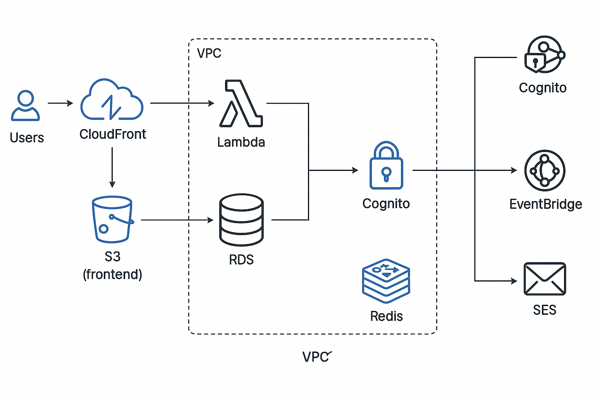

# Simple Blog Migration

**A fully serverless, scalable blog platform with database migration, media upload, search, caching, and notifications.**

---

## 🚀 Project Phases

| Phase | Description                                                     | Status       |
|-------|-----------------------------------------------------------------|--------------|
| 1     | Backend Setup (Node.js, Express, PostgreSQL)                    | ✅ Complete  |
| 2     | Blog API Development (Full CRUD)                                 | ✅ Complete  |
| 3     | Database Migration (RDS, Secrets Manager)                       | ✅ Complete  |
| 4     | Frontend Development (React scaffold + UI improvements)         | ✅ Complete  |
| 5     | Deployment to AWS (EC2, RDS, ALB)                               | ✅ Complete  |
| 6     | Deploy Frontend (S3 + CloudFront + HTTPS)                       | ✅ Complete  |
| 7     | Core Features (CRUD on UI)                                      | ✅ Complete  |
| 8     | AWS‑Native Enhancements (Lambda, API Gateway, CI/CD)           | ✅ Complete  |
| 9     | UI/UX & Authentication (Cognito + styling)                     | ✅ Complete  |
| 10    | Advanced Features (Image Upload, Search, Caching, Notifications) | 🚧 In Progress |

---

## 🌐 Live Demo

- **Frontend App:** https://scalabledeploy.com/  
- **API (Get Posts):** https://scalabledeploy.com/api/posts

---

## ⚡ Quick Start

```bash
# 1. Clone and install
git clone https://github.com/omare84/simple-blog-migration.git
cd simple-blog-migration
npm install

# 2. Backend
cd simple-blog-backend
npm install
# set env vars in .env (see below)
npm start

# 3. Frontend
cd ../simple-blog-frontend
npm install
npm start

# 4. SAM (for serverless stack)
# Requires AWS CLI configured
dotenv -e .env.sam sam build
sam local start-api
```

### Environment Variables (`.env`)
```
DB_HOST=...            # RDS endpoint
DB_NAME=simple_blog
DB_USER=postgres
# Use Secrets Manager or plain text for demo
DB_PASSWORD=...
FRONTEND_DOMAIN=scalabledeploy.com
COGNITO_USER_POOL_ID=...
COGNITO_APP_CLIENT_ID=...
``` 

---

## 🏗️ Architecture



**Flow:** CloudFront → S3 (static files) + API Gateway → Lambda → RDS/Redis → Cognito for auth → EventBridge → SES

---

## 💰 Cost Optimization

- **Auto‑teardown**: ElastiCache and other non‑prod resources cleaned up via CloudFormation.
- **S3 Lifecycle**: Archive or expire objects older than 30 days to reduce storage costs.
- **Reserved Concurrency**: Limit Lambda concurrency to avoid over‑provisioning.
- **Infra as Code**: All resources managed by SAM—no manual drift.

---

## ✨ Key Features

- **CRUD**: Create, Read, Update, Delete blog posts.
- **Authentication**: AWS Cognito sign‑up, sign‑in, protected routes.
- **Media Upload**: Presigned S3 URLs for image attachments.
- **Search/Tagging**: Full‑text search and tag filters (PostgreSQL TSVector).
- **Caching**: Redis (ElastiCache) for high‑performance read caching.
- **Notifications**: EventBridge + SES emails on new post creation.
- **CI/CD**: GitHub Actions → SAM deploys entire stack.

---

## 🛠️ Prerequisites

- Node.js v16+  
- AWS CLI configured  
- AWS SAM CLI  
- AWS account with proper IAM permissions

---

## 📋 Detailed Setup

1. **Backend Setup**  
   - Install Node.js dependencies.  
   - Configure `.env`.  
   - Run migrations to create `posts` (and `subscribers`) tables.
2. **Frontend Setup**  
   - Install React dependencies.  
   - Configure Amplify/Cognito.  
3. **Infrastructure**  
   - `sam build && sam deploy --guided` to provision:
     - Lambda functions, API Gateway REST API
     - RDS PostgreSQL, Secrets Manager
     - ElastiCache Redis cluster
     - S3 buckets & CloudFront distribution
     - Cognito User Pool and App Client
     - EventBridge Rule & SES permissions
4. **Deployment**  
   - Frontend: `npm run build` → `aws s3 sync build/ s3://<bucket>`  
   - Invalidate CloudFront cache: `aws cloudfront create-invalidation ...`
5. **Testing**  
   - Sign up, sign in with Cognito.  
   - Create/edit/delete posts with image upload.  
   - Search posts, view cached performance.  
   - Subscribe and receive notification emails.

---

## 📖 Documentation & Further Reading

- [AWS SAM Developer Guide](https://docs.aws.amazon.com/serverless-application-model/latest/developerguide/)
- [Tailwind CSS Docs](https://tailwindcss.com/docs)
- [PostgreSQL Full‑Text Search](https://www.postgresql.org/docs/current/textsearch.html)

---

*Built with love by Omar E.*
